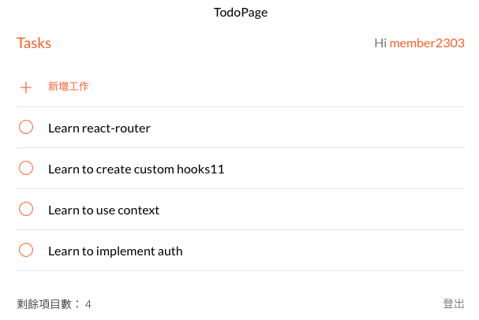

# Todo List X MVC with React

## Features of the project
- add TodoItem
- remove TodoItem
- signup/login/logout account

### How to view the project?
1. Please download the ZIP file or Git Clone this repo.
2. In the project directory, you can run: `npm install`
3. `npm start` to view the project. http://localhost:3000
4. Page
  - SignupPage : http://localhost:3000/signup
  - LoginPage : http://localhost:3000/login
  - TodoPage : http://localhost:3000/todo
5.  The page will reload when you make changes.

### development tools
|Name |Version|
|-----|--------|
|node.js|16.16.0      |
|react  |18.2.0    |
|react-dom  |18.2.0    |
|react-router-dom |6.4.1    |
|axios |0.27.2    |
|styled-components |5.3.5    |
|sweetalert2 |11.6.4    |